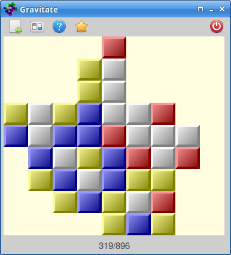

# Gravitate

A SameGame/TileFall-like game written in D/GtkD.

Superceded by the superior [Rust/FLTK](https://github.com/mark-summerfield/gravitate-rs) version.

## Build

You will need a D compiler and the GtkD 3 library.

To get a D compiler (I use LDC) see: 
[dlang.org/download.html](https://dlang.org/download.html).

Once D is installed, install the Gtk runtime, then download and install
the GtkD library. For these, see:
[gtkd.org](https://gtkd.org/).

Make sure `dub` can find GtkD by running:

`dub add-path path/to/GtkD3`

Then, in the directory you've cloned or unpacked Gravitate, if using LDC
run:

`dub -brelease`

(For other compilers either just run `dub` or lookup how to do a release
build.)

Then, move the gravitate executable to somewhere convenient.

## License

GPL-3.0.

## Other Versions

For versions in Nim/NiGui, Java/AWT/Swing, Python/Tkinter,
Python/wxPython, and JavaScript see
[www.qtrac.eu/gravitate.html](http://www.qtrac.eu/gravitate.html).

## Windows

I can only get it to run on Windows by installing the Gtk runtime, D, and
GtkD as described in Build above.

Windows 10 "Defender" complains about installing the Gtk runtime with a
scary message and only allowing you to install it by clicking "More Info"
and then "Install Anyway".

So, for Windows users just wanting an executable, the Nim `.zip` is
easiest to use.
